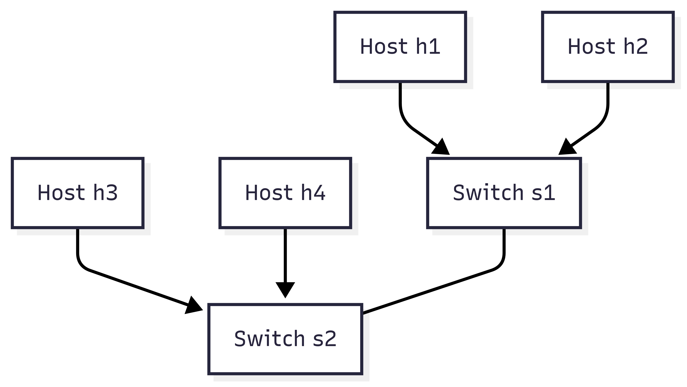
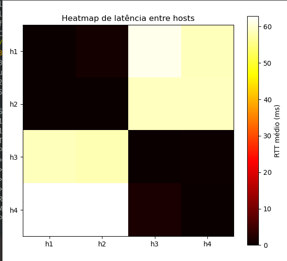
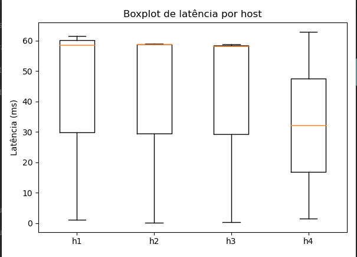
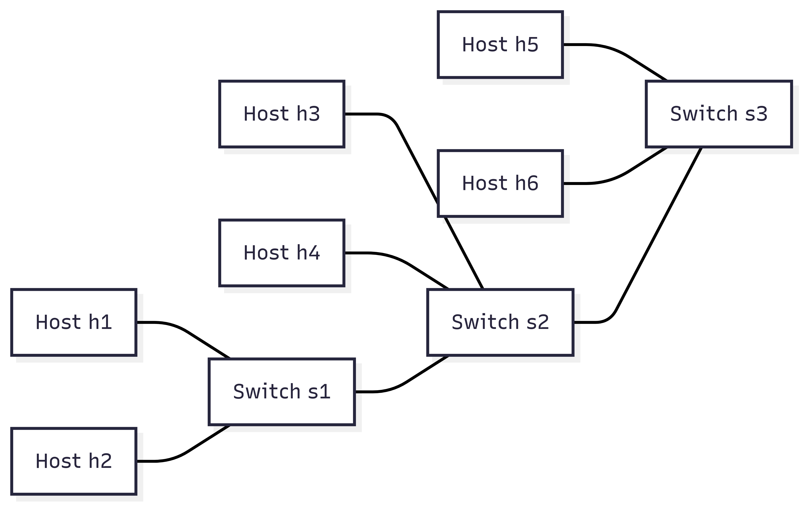
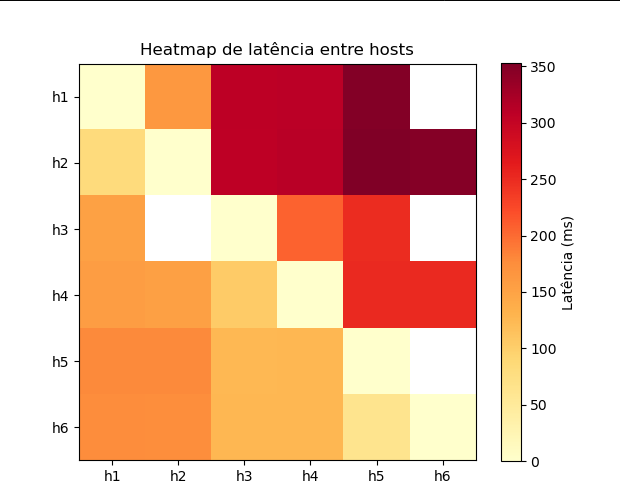

# Experimentos de Redes com Mininet – Mini-Aula e Análise de Clusterização

Este repositório contém experimentos e análises de topologias de rede usando o Mininet, com foco em latência, ruído e clusterização de hosts. Os experimentos incluem a medição de RTT, geração de heatmaps e boxplots para análise didática em aulas de redes e clusterização.

---------------------------------------------------------
Estrutura do Repositório

boxplot.png
heatmap.png
topologia_extendida.png
topo_new.png
topologia_rede.png
experimento/
hello/

Diretórios:

experimento/
    rede.py        -> Topologia básica de 4 hosts com medição de latência, heatmap e boxplot.
    rede_nova.py   -> Topologia estendida de 6 hosts, com clusters adicionais e ruído na rede.

hello/
    hello.py       -> Experimento de comunicação cliente-servidor simples entre dois hosts.
    notas.pdf      -> Material de apoio ou documentação adicional do experimento.

Arquivos de figuras:

boxplot.png                -> Boxplot de latência por host.
heatmap.png                -> Heatmap de latência entre hosts.
topologia_extendida.png     -> Diagrama da topologia estendida (6 hosts, 3 clusters).
topo_new.png               -> Heatmap/diagrama da nova topologia.
topologia_rede.png         -> Diagrama da topologia inicial.

---------------------------------------------------------
## Experimentos e Mini-Aula

### 1. Topologia básica (`rede.py`)
- 4 hosts (h1–h4), 2 switches (s1, s2), link ruidoso.  
- Mede RTT entre pares de hosts.  
- Gera Heatmap e Boxplot para análise.  
- Observação: dois clusters naturais de hosts com baixa latência interna; alta latência entre clusters.

**Topologia inicial:**

**Heatmap de Latência:**

**Boxplot de Latência:**

---

### 2. Topologia estendida (`rede_nova.py`)
- Acrescenta Cluster 3 (h5, h6 via s3) à topologia.  
- Mede impacto na latência média geral e nos padrões de clusterização.

**Topologia Estendida:**

**Heatmap Novo Cluster:**

**Observações:**
- Cluster 3 tem baixa latência interna (~0–50ms).  
- Latência entre Cluster 3 e Clusters 1/2 é maior (~150–350ms) devido aos caminhos via múltiplos switches.  
- Indiretamente aumenta a latência média geral da rede.

---

### 3. Experimento Cliente-Servidor (`hello.py`)
- Demonstra comunicação TCP simples entre h1 (servidor) e h2 (cliente).  
- Logs armazenados em `/tmp/h1_log` e `/tmp/h2_log`.

---

## Mini-Aula Sugerida

- Conceitos: **latência**, **jitter**, **clusterização**, **impacto do ruído em links**.  
- Exercício Boxplot:
  - Identificar host com maior dispersão (jitter) e explicar causas (ruído, múltiplos caminhos, proximidade).  
- Exercício Extensão de Topologia:
  - Adicionar hosts/switch e analisar como a latência média e a clusterização são impactadas.  
- Interpretação Heatmap:
  - Diagonal principal = latência zero.  
  - Cores mais claras = maior RTT.  
  - Permite identificar clusters naturais na rede.

---

---------------------------------------------------------
Comandos para Execução

1. Topologia básica:
sudo python3 experimento/rede.py

2. Topologia estendida:
sudo python3 experimento/rede_nova.py

3. Experimento hello:
sudo python3 hello/hello.py

Observações:
- Executar scripts com permissões de superusuário devido ao Mininet.
- Visualizar heatmaps e boxplots para análise de clusterização, jitter e impacto do ruído.
- Ideal para uso em aulas práticas de redes e clusterização de servidores.
